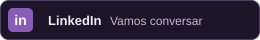
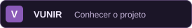
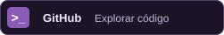

<!--
  CARLOS — perfil de rzxcarlos
  Publique este README e a pasta assets/ na raiz de rzxcarlos/rzxcarlos.
  As animações do cabeçalho e do rodapé são locais: não precisam de token.
-->

<picture>
  <source media="(max-width: 600px)" srcset="./assets/hero-mobile.svg">
  
</picture>

<p align="center">
  <a href="#sobre">Sobre</a> &nbsp; / &nbsp;
  <a href="#stack">Stack</a> &nbsp; / &nbsp;
  <a href="#projetos">Projetos</a> &nbsp; / &nbsp;
  <a href="#contato">Contato</a>
</p>

<p align="center">
  <a href="https://www.linkedin.com/in/carlos-silva-ceo/">
    
  </a>
  <a href="https://vunir.com.br">
    
  </a>
  <a href="https://github.com/rzxcarlos?tab=repositories">
    
  </a>
</p>

<br>

<a id="sobre"></a>
## 🧑‍💻 `01` — Além do hello world

Sou **Carlos Silva**, desenvolvedor que gosta de conectar **código, design e produto**.
Meu lugar favorito em um projeto é entre o **“e se a gente criasse...?”** e o **“já dá para usar”**.

Trabalho com aplicações web, também programo em **Python** e exploro o desenvolvimento Android. Na **Vunir**, transformo essa vontade de construir em uma plataforma de criação e publicação de sites. Por aqui, você encontra projetos, experimentos e algumas boas desculpas para aprender algo novo.

```typescript
const carlos = {
  username: "rzxcarlos",
  foco: ["Desenvolvimento full stack", "Produtos digitais"],
  linguagens: ["Java", "Python", "TypeScript", "JavaScript", "Kotlin"],
  construindo: "Vunir",
  aprofundando: ["Java", "Lambdas", "Design Patterns"],
  explorando: ["Android com Kotlin", "IA aplicada a produtos"],
  principio: "Uma interface bonita também precisa funcionar bem.",
} as const;
```

> 🧩 **Meu tipo de desafio:** pegar uma ideia solta, entender o problema e construir algo que faça sentido para quem vai usar.

<br>

<a id="stack"></a>
## 🛠️ `02` — Minha caixa de ferramentas

Tecnologias que uso ou exploro nos meus projetos — cada uma com seu lugar, sem escolher ferramenta antes de entender o problema.

<table>
  <tr>
    <td width="50%" valign="top">
      <h3>⌨️ Linguagens</h3>
      
      <p>Java · Python · TypeScript · JavaScript · Kotlin</p>
    </td>
    <td width="50%" valign="top">
      <h3>🎨 Interfaces</h3>
      
      <p>React · Next.js · Tailwind CSS</p>
    </td>
  </tr>
  <tr>
    <td width="50%" valign="top">
      <h3>⚙️ Backend e dados</h3>
      
      <p>Node.js · PostgreSQL · Supabase</p>
    </td>
    <td width="50%" valign="top">
      <h3>📱 Mobile e ferramentas</h3>
      
      <p>Jetpack Compose · Firebase · Git · GitHub</p>
    </td>
  </tr>
</table>

<br>

<a id="projetos"></a>
## 🚀 `03` — Ideias que viraram projetos

### 🦊 Vunir · Da ideia ao site

Uma plataforma para criar e publicar sites, conectando **templates, edição visual e uma experiência simples de usar**.
É onde junto desenvolvimento, decisões de produto e atenção aos detalhes da interface.

**[Conheça a Vunir ↗](https://vunir.com.br)**

<br>

<details>
  <summary><strong>🎮 Missão secundária desbloqueada</strong></summary>
  <br>
  <p>Tem uma boa ideia, um problema interessante ou um projeto que merece sair do papel?</p>
  <p>Gosto de conversar sobre produtos, interfaces e as decisões que fazem o software funcionar melhor.</p>
  <blockquote>O próximo projeto interessante pode começar com uma conversa.</blockquote>
</details>

<!-- A cobrinha é opcional. Veja optional/COBRINHA.md antes de adicionar a imagem. -->

<br>

<a id="contato"></a>
## 🤝 `04` — Vamos construir algo?

Para trocar ideias, falar sobre desenvolvimento ou conversar sobre oportunidades, me encontre no **[LinkedIn](https://www.linkedin.com/in/carlos-silva-ceo/)**.

<p align="center">
  <a href="https://www.linkedin.com/in/carlos-silva-ceo/">
    
  </a>
</p>

<br>

<picture>
  <source media="(max-width: 600px)" srcset="./assets/footer-mobile.svg">
  
</picture>

<p align="center"><sub>Feito de curiosidade, código e vontade de construir. 💜</sub></p>
